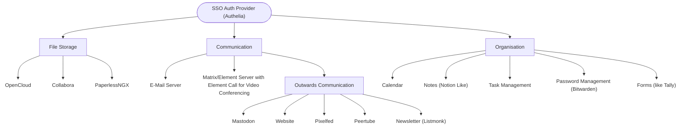
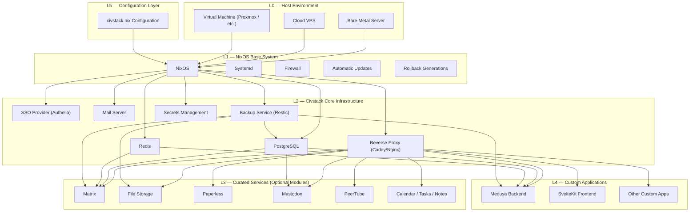

# Civ-Stack Server Infrastructure

A NixOS based operating system, hosting relevant software for ngos and other organisations that don’t want to rely on (american) saas products for their communication and organisational structure.

This is an opinionated stack with a built in reverse proxy with relevant pre-configured applications and the ability to extend the server with custom applications.

## Possible Application Structure

## Possible Architecture

