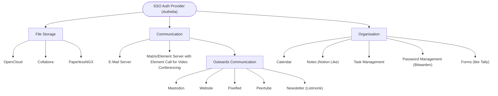

# Server Coop

Some sort of coop for shared infrastructure for e.g. non-profits to obtain sovereign clouds, video conferencing, mails and websites

```mermaid
flowchart TB
    A(["SSO Auth Provider (Authelia)"]) --> n1["File Storage"] & n5["Communication"] & n13["Organisation"]
    n1 --> n2["OpenCloud"] & n3["Collabora"] & n4["PaperlessNGX"]
    n5 --> n6["E-Mail Server"] & n7["Matrix/Element Server with Element Call for Video Conferencing"] & n8["Outwards Communication"]
    n8 --> n9["Mastodon"] & n10["Website"] & n11["Pixelfed"] & n12["Peertube"] & n19["Newsletter (Listmonk)"]
    n13 --> n14["Calendar"] & n15["Notes (Notion Like)"] & n16["Task Management"] & n17["Password Management (Bitwarden)"] & n18["Forms (like Tally)"]

    n2@{ shape: text}
    n3@{ shape: text}
    n4@{ shape: text}
    n6@{ shape: text}
    n7@{ shape: text}
    n9@{ shape: text}
    n10@{ shape: text}
    n11@{ shape: text}
    n12@{ shape: text}
    n19@{ shape: text}
    n14@{ shape: text}
    n15@{ shape: text}
    n16@{ shape: text}
    n17@{ shape: text}
    n18@{ shape: text}
```
